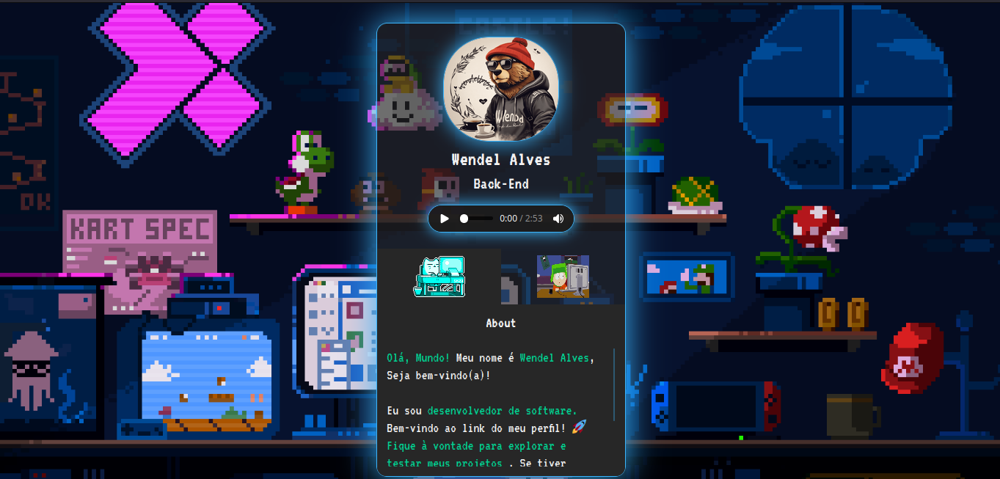

### Descrição

O projeto consiste em um site simples que serve como um link para informações do usuário. Inclui uma breve descrição sobre ele e links para contatos e redes sociais.

### Recursos

* Uma página inicial com informações básicas sobre o usuario, como seu nome, profissão e links para suas redes sociais.
* Uma página "Sobre mim" com uma descrição mais detalhada, seus interesses e seus objetivos profissionais.
* Uma página "Redes Sociais" com links para os perfis do usuario nas principais redes sociais.
* Um design responsivo que adapta o layout do site para diferentes tamanhos de tela.

### Dependências

* Go
* HTML
* CSS
* JavaScript

### Instruções de instalação

1. Clone o repositório do projeto.
2. Abra o arquivo `index.html` em um navegador web.

### Contribuições

São bem-vindas contribuições de todos os tipos, desde melhorias no código-fonte até sugestões de novos recursos. Para contribuir, basta abrir uma solicitação pull no repositório do projeto.

### Exemplo

